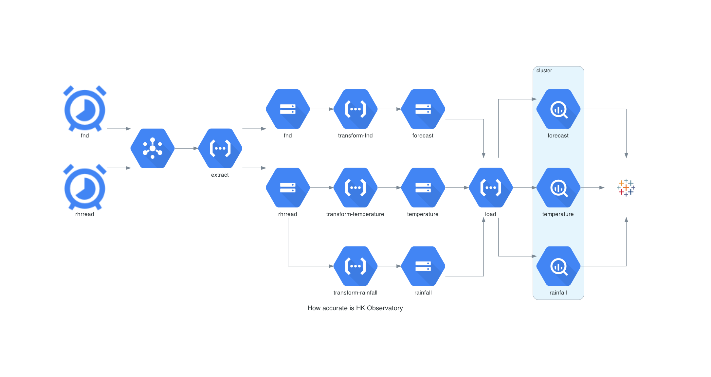

# How accurate is HK Observatory?

## Introduction
Hong Kong Observatory attracts so much complains on the forecast, especially when raising typhoon and rainstorm signals. Yet, what is the actual accuracy? This project compares the foreacst and actual weather from [Hong Kong Observatory Open Data](https://www.hko.gov.hk/en/abouthko/opendata_intro.htm).

## Infrastructure (Google Cloud Platform)

## Usage
Change directory to `infrastructure/<env>`, populate variables in `terraform.tfvars`  and run the following commands.
* `terraform init`: initialise the directory
* `terraform plan`: generate the execution plan
* `terraform apply`: apply the execution plan
* `terraform destroy`: destroy the infrastructure

## IAM Roles
The following Service Accounts must have the following IAM role:
* Cloud Storage Service Account: `pubsub.publisher`

## APIs
This project requires the following APIs enabled:
* Artifact Registry API: `artifactregistry.googleapis.com`
* BigQuery JSON API: `bigquery.googleapis.com`
* Cloud Build API: `cloudbuild.googleapis.com`
* Cloud Functions API: `cloudfunctions.googleapis.com`
* Cloud Run Admin API: `run.googleapis.com`
* Cloud Scheduler API: `cloudscheduler.googleapis.com`
* Cloud Storage API: `storage.googleapis.com`
* Eventarc API: `eventarc.googleapis.com`

## See also
[HKO Open Data API Documentation](https://www.hko.gov.hk/en/weatherAPI/doc/files/HKO_Open_Data_API_Documentation.pdf)